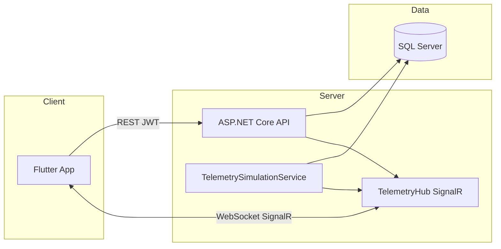

# Architecture — Clinical Device Management System

## Component diagram

## Data flow (live monitoring)

1. Clinician starts a session via `POST /api/sessions/start`.
2. API registers the session in `SimulationState`; the background service emits synthetic readings at ~10 Hz (configurable up to 125 Hz).
3. Readings are persisted to `Readings` and pushed to SignalR groups (`session:{id}`, `device:{id}`).
4. Flutter subscribes via `TelemetryHub.SubscribeSession` and appends points to a rolling 30-second chart buffer.
5. Threshold spike (`POST /api/devices/{id}/simulate`) forces out-of-range values → `Alerts` row + `AlertRaised` event.

## Security

- JWT bearer on all REST endpoints and the SignalR hub.
- Roles: **Admin**, **Clinician**, **Tech** (role-based authorization on mutating endpoints).

## Database schema

| Table | Purpose |
|-------|---------|
| Devices | Hardware inventory & status |
| Patients | Synthetic patient registry |
| Sessions | Monitoring periods (device + optional patient) |
| Readings | Time-series telemetry |
| Alerts | Threshold / critical events |
| Users | Authentication |
